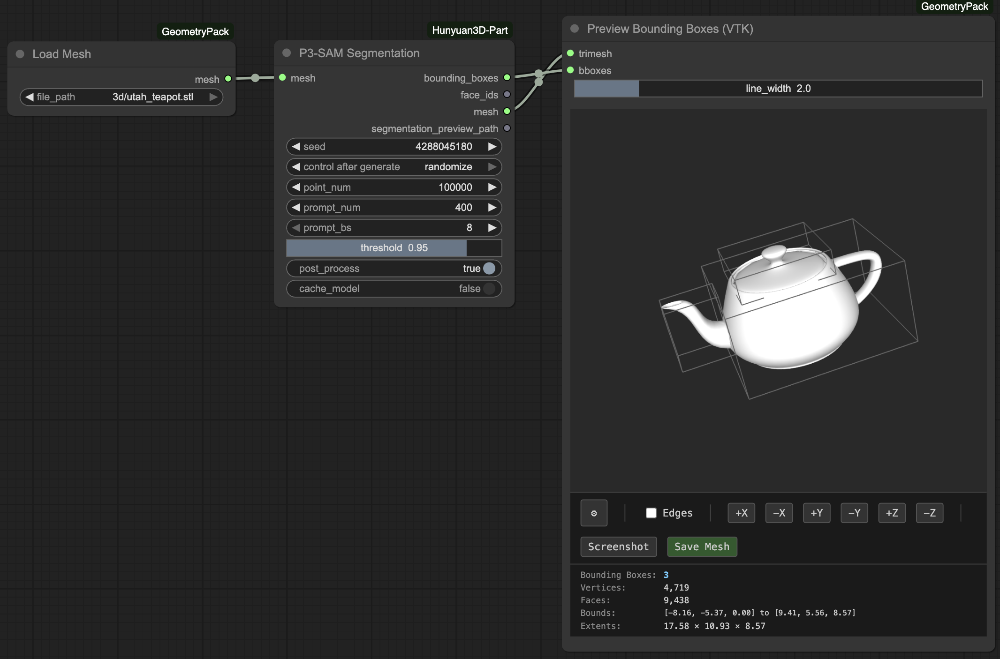
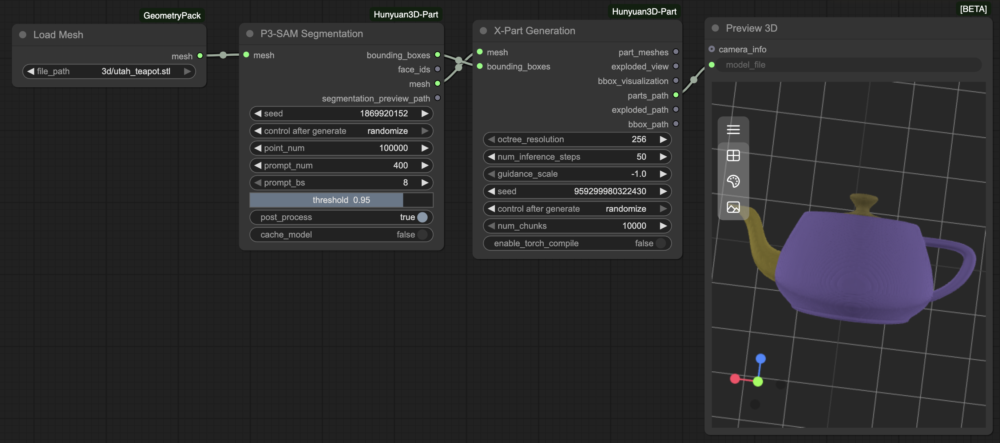

# ComfyUI-Hunyuan3D-Part




ComfyUI custom nodes for Hunyuan3D-Part: 3D part segmentation and generation.

## Features

- **P3-SAM Segmentation**: Segment 3D meshes into parts
- **X-Part Generation**: Generate high-quality part meshes using diffusion
- **Full Pipeline**: Combined node for complete workflow
- **Comprehensive Tests**: Cross-platform CI and GPU integration tests

## Installation

```bash
cd ComfyUI/custom_nodes
git clone [your-repo-url]
cd ComfyUI-Hunyuan3D-Part
python install.py
```

The installer will automatically:
- Detect your PyTorch and CUDA versions
- Install required dependencies
- Handle CUDA-specific packages (spconv, torch-scatter, torch-cluster)
- Set up the environment for ComfyUI

## Testing

This project includes comprehensive tests to ensure cross-platform compatibility:

### Quick Start

```bash
# Install test dependencies
pip install pytest pytest-timeout

# Run CI tests (fast, no GPU needed)
pytest -m ci

# Run integration tests with real models (requires GPU)
pytest -m integration
```

### Test Categories

- **CI Tests**: Fast validation (imports, structure, mock inference) - runs on Windows, Linux, macOS
- **Integration Tests**: Full workflow testing with real models - requires GPU

### GitHub Actions

Tests run automatically on every push/PR:
- ✅ Multi-OS testing (Ubuntu, Windows, macOS)
- ✅ Python 3.10 and 3.11
- ✅ Installation validation
- ✅ Import and structure checks
- ✅ Mock model logic tests

See [TESTING.md](TESTING.md) for detailed documentation.

## Credits

Based on [Hunyuan3D-Part](https://github.com/tencent/Hunyuan3D-Part) by Tencent.
