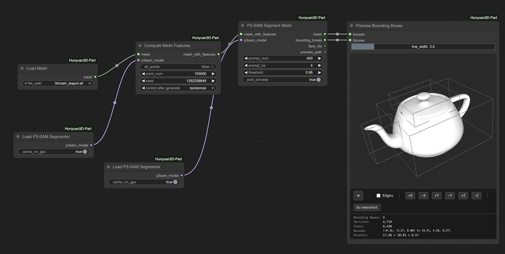
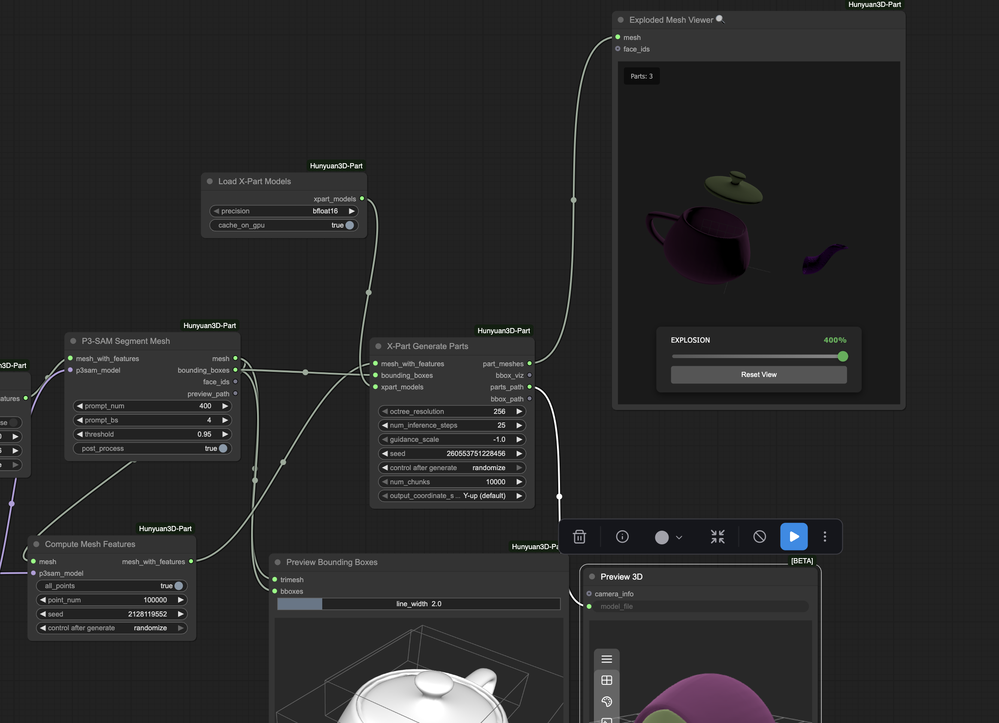

# ComfyUI-Hunyuan3D-Part

ComfyUI custom nodes for Hunyuan3D-Part: 3D part segmentation and generation.

## Features

**P3-SAM Segmentation**: Segment 3D meshes into parts

**X-Part Generation**: Generate high-quality part meshes using diffusion

## Performance & Troubleshooting

### Memory Issues
If X-Part workflows crash or freeze your machine:
- See **[MEMORY_OPTIMIZATION.md](MEMORY_OPTIMIZATION.md)** for detailed solutions
- Quick fix: Lower `octree_resolution` to 256 in XPartGenerateParts node
- Set `cache_on_gpu=False` in LoadXPartModels to free VRAM after generation

### Speed Improvements
✅ **Flash Attention is now enabled by default** (~10-20% speedup)
- Automatically used if `flash-attn` package is available
- To disable: Edit `nodes/core/config/sonata.json`, set `"enable_flash": false`

### Configuring Point Cloud Density (num_points)
Current default: **40,960 points** per object/part
- To adjust: Edit `nodes/core/config/infer.yaml`, lines 26 and 62
- Lower values = less VRAM, potential quality loss
- Restart ComfyUI after changing

See **[MEMORY_OPTIMIZATION.md](MEMORY_OPTIMIZATION.md)** for complete tuning guide.

## Community

Questions or feature requests? Open a [Discussion](https://github.com/PozzettiAndrea/ComfyUI-Hunyuan3D-Part/discussions) on GitHub.

Join the [Comfy3D Discord](https://discord.gg/bcdQCUjnHE) for help, updates, and chat about 3D workflows in ComfyUI.

## Credits

Based on [Hunyuan3D-Part](https://github.com/tencent/Hunyuan3D-Part) by Tencent.